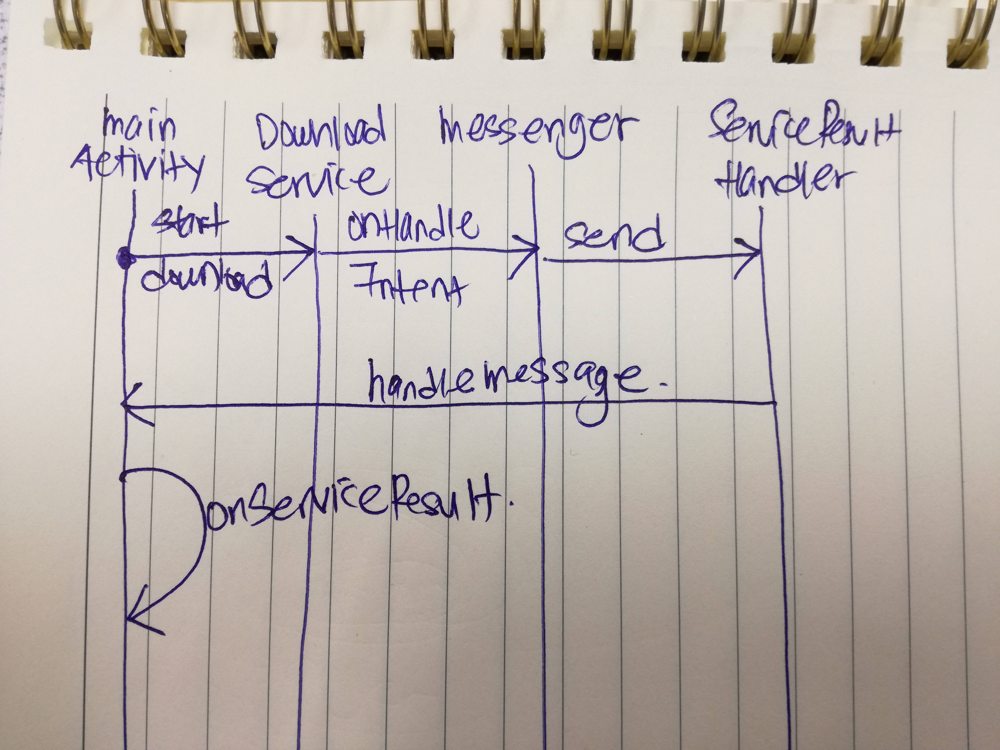

# Overview

Sample Android Application to download the most recent CNN YouTube listing like the one from [Course 3 Week 2 Assignment](https://github.com/yeongwei/AndroidSpecialisation-course3-week2-assignment1). However the result are handled with `Messenger` instance instead of the `BroadcastReceiver` instance.

# Note

1. The [android.os.Messenger](https://developer.android.com/reference/android/os/Messenger) constructor takes a [android.os.Handler](https://developer.android.com/reference/android/os/Handler) as arguement. This `Messenger` object can be passed around processes for intercommunications.

2. The invocation of `Messenger#send` method will propage the `payload` to the `Handler` instance passed as argument in the constructor that is handled by the `handleMessage` method.

# Diagram Illustration

